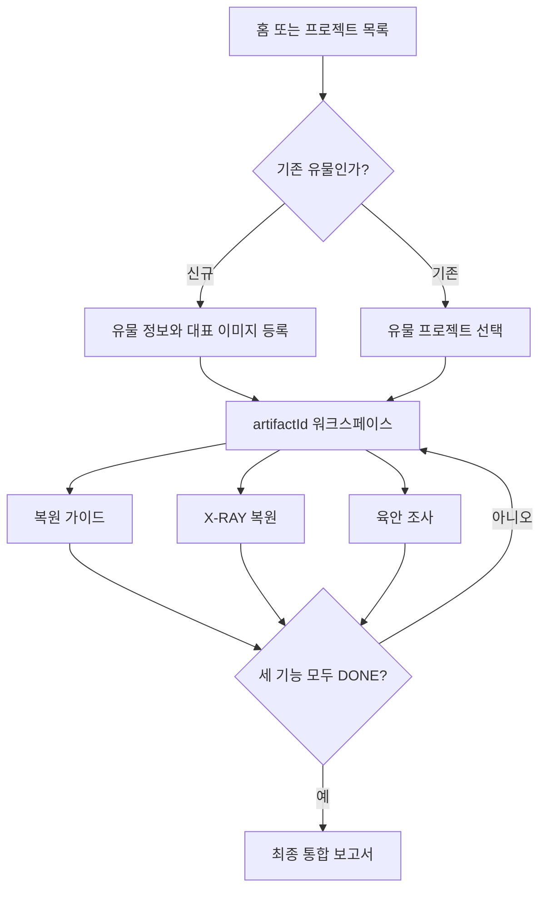
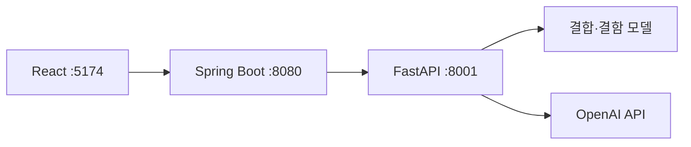
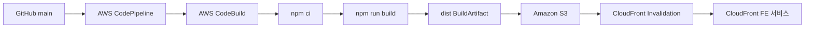

# VORA Frontend

문화유산 보존처리 과정을 관리하는 React 기반 프론트엔드입니다.

현재 애플리케이션은 하나의 유물 `artifactId` 아래에서 다음 세 기능을
서로 독립적으로 실행하는 구조입니다.

- 유물 복원 가이드: 해체·세척·강화·접합·복원 공정 안내 및 작업 기록
- X-RAY 복원: 파편 결합, 배치 보정, 결함 후보 검수, 상태조사 문안 작성
- 육안 조사: 컬러 이미지 기반 손상 조사와 전문가 판정

세 기능은 원하는 순서로 진행할 수 있습니다. 세 기능이 모두 `DONE`일 때만
최종 통합 보고서가 활성화됩니다.

## 1. 전체 서비스 흐름



1\. 홈에서 `유물 복원 가이드`, `X-RAY 복원`, `육안 조사` 중 하나를
   선택합니다.
2\. 기존 프로젝트를 선택하거나 신규 유물을 등록합니다.
3\. 신규 등록 시 대표 컬러 이미지와 유물명·재질·시대 등을 입력합니다.
4\. 등록 후 선택한 기능으로 바로 이동하며, 모든 URL에는 `artifactId`가
   유지됩니다.
5\. 프로젝트 상세에서는 세 기능의 상태를 각각 확인하고 이어서 진행합니다.
6\. 세 기능 완료 후 최종 통합 보고서를 생성합니다.

대표 경로는 다음과 같습니다.

| 화면              | 경로                                  |
| ----------------- | ------------------------------------- |
| 홈                | `/`                                   |
| 프로젝트 목록     | `/worklist`                           |
| 신규 유물 등록    | `/artifacts/new`                      |
| 유물 워크스페이스 | `/artifacts/:artifactId`              |
| 복원 가이드       | `/artifacts/:artifactId/guide`        |
| X-RAY 복원        | `/artifacts/:artifactId/xray`         |
| 육안 조사         | `/artifacts/:artifactId/visual`       |
| 최종 통합 보고서  | `/artifacts/:artifactId/final-report` |

기존 `/flow-recommendation`, `/pre-investigation/xray`, `/disassembly` 같은
URL은 `LegacyArtifactRedirect`가 현재 선택된 유물의 새 URL로 이동시킵니다.

## 2. 기능별 상세 프로세스

### 2.1 유물 등록과 워크스페이스

- 홈의 빠른 메뉴에서 시작할 기능을 먼저 선택합니다.
- 기존 프로젝트를 고르면 해당 기능의 이전 상태를 유지한 채 진입합니다.
- 신규 등록 시 유물 공통 정보와 대표 컬러 이미지를 한 번만 등록합니다.
- 프로젝트 상세에서 `GUIDE`, `XRAY`, `VISUAL` 상태를 독립 관리합니다.
- 상태값은 `NOT_STARTED`, `IN_PROGRESS`, `REVIEW_REQUIRED`, `DONE`,
  `NEEDS_UPDATE`, `FAILED`를 사용합니다.
- 프로젝트 삭제 시 유물 정보, 로컬 이미지, 연결된 로컬 보고서를 함께
  정리합니다.

현재 기본 저장 모드는 `local`입니다.

- 유물 목록·정보·기능 상태: `localStorage`
- 대표 이미지 Blob: `IndexedDB`
- 임시 유물 ID: `artifact-{timestamp}`

이 데이터는 같은 브라우저와 같은 주소에서만 유지되며 브라우저 데이터 삭제
시 사라집니다. Spring의 유물 CRUD와 S3 연동이 끝나면
`VITE_ARTIFACT_STORAGE_MODE=api`로 전환합니다.

### 2.2 유물 복원 가이드

```text
Flow 선택
→ POST /tasks/{taskId}/start
→ 해체
→ 세척
→ 강화
→ 접합
→ 복원
→ GUIDE 완료
```

- 현재 AI 추천 Flow는 서버 추천 결과가 아니라
  `DEFAULT_GUIDE_FLOW`를 사용하는 임시 값입니다.
- 사용자는 공정 사용 여부를 선택한 후 작업을 시작합니다.
- 시작 응답과 각 `resume` 응답의 `interrupt`를 `applyInterrupt()`가
  `DisassemblyContext`에 반영합니다.
- 각 공정은 추천 항목 확인·수정, 단계 완료, 선택적 작업 후 기록으로
  구성됩니다.
- 강화에서는 처리 전후 사진을 비교해 색 변화·습윤 효과를 확인합니다.
- 접합에서는 임시접합 전후 사진을 분석하고 작업자가 진행 여부를 결정합니다.
- 마지막 활성 공정을 마치면 `GUIDE` 상태를 `DONE`으로 바꾸고 유물
  워크스페이스로 돌아갑니다.

가이드 공정은 선택한 Flow에 따라 건너뛸 수 있습니다. 공정 이동에는
`approvedFlow`만 사용하며, 삭제된 `처리 후 기록/별도 보고서` 페이지로
이동하지 않습니다. 작업 후 기록은 각 공정 메인 화면 안에 있습니다.

주의: `taskId`, 승인 Flow, 공정별 상세 진행 데이터는 현재 React Context에만
있습니다. 브라우저 새로고침 시 복구되지 않으므로 서버 저장·재조회가 남은
작업입니다.

### 2.3 X-RAY 복원

```text
1\. X-RAY 조각 이미지 등록
2\. AI 결합 Job 접수 및 상태 폴링
3\. 결합 결과 확인·수동 위치 보정·확정
4\. 결합본과 원본 조각 결함 후보 탐지
5\. 정상 후보 제외·소견 수정
6\. 상태조사 문안 생성·편집
7\. 최종 검토 후 XRAY 완료
```

- X-RAY 조각은 2장 이상 필요합니다.
- 결합은 시간이 오래 걸릴 수 있어 Job 생성 후
  `PENDING → RUNNING → COMPLETED/FAILED` 상태를 폴링합니다.
- 서버의 `layout` 결과가 있으면 Konva 편집기에서 조각 위치와 회전을
  수동 보정할 수 있습니다.
- 결합 결과는 사람이 `확정`해야 결함 분석으로 넘어갑니다.
- 결함 후보는 처음부터 모두 이상 영역으로 포함하고, 작업자가 정상으로
  판단한 후보만 제외합니다.
- 제외한 후보는 문안 생성 대상에서 빠지며, 실수로 제외한 항목은 되돌릴 수
  있습니다.
- 검수된 영역, 소견, 결합본, 원본 조각, 대표 컬러 이미지를 바탕으로
  상태조사 문안을 생성합니다.
- 최종 검토를 마치면 `XRAY` 상태를 `DONE`으로 바꾸고 워크스페이스로
  돌아갑니다.

주의: 현재 완료 상태만 유물 프로젝트에 저장됩니다. 결합본, 보정 좌표,
결함 목록, 제외 목록, 문안은 새로고침 이후 복구되지 않으므로 X-RAY 결과
저장 API가 추가로 필요합니다.

### 2.4 육안 조사

현재 화면과 완료 상태 변경만 구현되어 있습니다.

- 유물 정보 조회
- 고정된 예시 분석 결과 표시
- 전문가 검수 안내 표시
- `육안 조사 완료` 클릭 시 `VISUAL` 상태를 `DONE`으로 변경

실제 이미지 위 손상 위치 표시, 손상 유형 입력·수정, AI/API 연결, 조사 결과
저장과 재조회는 아직 구현되지 않았습니다. 신규 FE 담당자가 독립적으로 맡기
가장 적합한 영역입니다.

### 2.5 최종 통합 보고서

- `GUIDE`, `XRAY`, `VISUAL`이 모두 `DONE`일 때만 활성화됩니다.
- 현재는 유물 정보와 세 모듈의 완료 상태를 묶어 화면에 표시합니다.
- `내 보고서에 저장`은 브라우저 로컬 데이터에 저장합니다.
- 세 기능의 실제 상세 결과 취합, 서버 저장, PPT 생성·다운로드는 아직
  구현되지 않았습니다.

## 3. 현재 통신 구조

실제 API 모드의 기본 구조는 다음과 같습니다.



브라우저는 Spring만 호출하고, Spring이 내부 AI 서비스인 FastAPI를
호출하는 방식으로 통일합니다. 따라서 브라우저 CORS는 Spring에서
`http://localhost:5174`를 허용해야 합니다. Spring과 FastAPI 사이의 서버 간
통신에는 브라우저 CORS가 적용되지 않습니다.

| 기능             | React가 호출하는 대상                                  |
| ---------------- | ------------------------------------------------------ |
| 복원 가이드 시작 | `POST /tasks/{taskId}/start`                           |
| 복원 가이드 진행 | `POST /tasks/{taskId}/resume`                          |
| 공정 사진 업로드 | `POST http://localhost:8080/photos/upload`             |
| X-RAY 결합 접수  | `POST http://localhost:8080/api/xray/stitch/jobs`      |
| X-RAY 결합 상태  | `GET .../stitch/jobs/{jobId}`                          |
| X-RAY 결합 결과  | `GET .../stitch/jobs/{jobId}/result`                   |
| X-RAY 배치 정보  | `GET .../stitch/jobs/{jobId}/layout`                   |
| AI 상태 확인     | `GET http://localhost:8080/api/xray/health`            |
| 결합본 결함 분석 | `POST http://localhost:8080/api/xray/detect/assembled` |
| 조각 결함 분석   | `POST http://localhost:8080/api/xray/detect/fragments` |
| 상태조사 문안    | `POST http://localhost:8080/api/xray/report`           |

유물 CRUD와 Presigned URL의 예정 계약은
[`docs/workspace-api-contract.md`](docs/workspace-api-contract.md)를 참고합니다.

## 4. 실행 방법

### 4.1 설치

```bash
npm ci
```

### 4.2 백엔드 없이 전체 UI 확인

```bash
npm run dev:mock
```

`vite --mode mock`이 `.env.mock`을 읽습니다. 이 모드에서는 X-RAY 결합·
결함 분석·문안 작성과 복원 가이드의 start/resume·사진 분석을 가짜 응답으로
진행합니다. Spring과 FastAPI가 없어도 됩니다.

### 4.3 실제 API 연동

`.env.example`을 복사해 `.env`를 만듭니다.

```bash
cp .env.example .env
npm run dev
```

기본 설정은 다음과 같습니다.

```env
VITE_ARTIFACT_STORAGE_MODE=local
VITE_API_BASE_URL=http://localhost:8080
VITE_ARTIFACTS_API_PATH=/api/artifacts
VITE_USE_XRAY_MOCK=false
VITE_USE_GUIDE_MOCK=false
VITE_XRAY_STITCH_API_BASE=http://localhost:8080/api/xray/stitch
VITE_XRAY_INSPECTION_API_BASE=http://localhost:8001
VITE_VIA_SPRING=true
VITE_XRAY_SPRING_INSPECTION_API_BASE=http://localhost:8080/api/xray
```

환경변수별 의미는 다음과 같습니다.

| 환경변수                               | `.env.example` 기본값                   | `.env.mock` 값 | 역할 및 사용 시점                                                                                                                                              |
| -------------------------------------- | --------------------------------------- | -------------- | -------------------------------------------------------------------------------------------------------------------------------------------------------------- |
| `VITE_ARTIFACT_STORAGE_MODE`           | `local`                                 | `local`        | 유물 정보와 기능 상태의 저장 방식을 정합니다. `local`은 `localStorage`·IndexedDB를 사용하고, Spring 유물 CRUD 구현 후 `api`로 변경합니다.                      |
| `VITE_API_BASE_URL`                    | `http://localhost:8080`                 | 미지정         | Spring Boot 공통 주소입니다. 유물 API와 X-RAY Spring 경유 주소의 기준으로 사용합니다. Mock 모드에서는 관련 API를 호출하지 않습니다.                            |
| `VITE_ARTIFACTS_API_PATH`              | `/api/artifacts`                        | 미지정         | `VITE_ARTIFACT_STORAGE_MODE=api`일 때 사용할 유물 CRUD 경로입니다. 현재 기본값인 `local`에서는 호출하지 않습니다.                                              |
| `VITE_USE_XRAY_MOCK`                   | `false`                                 | `true`         | X-RAY 결합, 결함 탐지, 문안 생성을 Mock 응답으로 실행할지 정합니다.                                                                                            |
| `VITE_USE_GUIDE_MOCK`                  | `false`                                 | `true`         | 복원 가이드의 task start/resume와 사진 분석을 Mock 응답으로 실행할지 정합니다. `--mode mock`에서도 자동으로 Mock이 활성화됩니다.                               |
| `VITE_XRAY_STITCH_API_BASE`            | `http://localhost:8080/api/xray/stitch` | 미지정         | X-RAY 조각 결합 Job의 접수·상태·결과·배치 정보 API 주소입니다. 기본 구조에서는 Spring을 호출합니다.                                                            |
| `VITE_XRAY_INSPECTION_API_BASE`        | `http://localhost:8001`                 | 미지정         | `VITE_VIA_SPRING=false`일 때만 사용하는 FastAPI 직접 호출 주소입니다. CORS와 서비스 단독 진단 목적의 예비 설정입니다.                                          |
| `VITE_VIA_SPRING`                      | `true`                                  | 미지정         | 결함 탐지·문안 생성 요청의 경유 방식을 정합니다. `true`이면 React → Spring → FastAPI, `false`이면 React → FastAPI로 호출합니다. 팀 공통 기본값은 `true`입니다. |
| `VITE_XRAY_SPRING_INSPECTION_API_BASE` | `http://localhost:8080/api/xray`        | 미지정         | `VITE_VIA_SPRING=true`일 때 사용하는 결함 탐지·문안 생성용 Spring API 주소입니다.                                                                              |

파일별 역할은 아래처럼 구분합니다.

| 파일           | 용도                                                     | Git 관리      |
| -------------- | -------------------------------------------------------- | ------------- |
| `.env`         | 개발자 개인의 로컬 실제 API 설정                         | 커밋하지 않음 |
| `.env.example` | 팀 공통 실제 API 설정 템플릿                             | 커밋함        |
| `.env.mock`    | `npm run dev:mock`에서 실제 설정을 덮어쓰는 Mock 전용 값 | 커밋함        |

`.env.mock`에 미지정된 값은 Vite의 일반 환경 파일 또는 코드 기본값을
따릅니다. 다만 Mock 플래그가 켜지므로 백엔드 API는 호출하지 않습니다.

`VITE_VIA_SPRING=true`이므로
`VITE_XRAY_INSPECTION_API_BASE=http://localhost:8001`은 직접 호출용 예비값이며
기본 실행에서는 사용하지 않습니다.

실행 순서:

1\. Spring Boot `8080`
2\. FastAPI `8001`
3\. React `npm run dev` (`http://localhost:5174`)

### 4.4 환경변수 변경 시 주의사항

- 환경변수를 변경한 뒤에는 Vite 개발 서버를 완전히 종료하고 다시 실행합니다.
- `VITE_` 접두사가 붙은 값은 브라우저 번들에 포함되므로 API 키, 비밀번호,
  토큰 같은 비밀값을 넣지 않습니다.
- 실제 API 테스트에서는 `VITE_VIA_SPRING=true`를 유지합니다.
- FastAPI 직접 호출은 서비스 단독 진단이 필요할 때만
  `VITE_VIA_SPRING=false`로 잠시 변경합니다.

### 4.5 검증

```bash
npm run lint
npm run build
npm run build -- --mode mock
```

실제 API 테스트에서는 브라우저 Network에서 결함 관련 요청이
`localhost:8001`이 아니라 `localhost:8080/api/xray`로 가는지 먼저
확인합니다.

## 5. 폴더 구조와 책임

```text
src/
├── components/
│   ├── common/      여러 페이지 공용 진행 UI
│   ├── routing/     artifactId 동기화와 구 URL 이동
│   ├── workspace/   유물 워크스페이스 공통 UI
│   └── xray/        X-RAY 전용 뷰어·편집기·진행 UI
├── context/         복원 가이드 세션 상태
├── data/            유물 상태·로컬 저장·화면 데이터
├── hooks/           공통 React Hook
├── pages/           라우트별 화면
├── services/        API와 mock 분기
├── styles/          복원 공정 공통 스타일
└── utils/           라우트·공정 이동·보고서 유틸리티
```

주요 파일:

| 파일                                      | 역할                                 |
| ----------------------------------------- | ------------------------------------ |
| `src/App.jsx`                             | 전체 라우트와 Provider               |
| `src/data/workspaceProjects.js`           | 유물 CRUD, 기능 상태, local/API 분기 |
| `src/data/localArtifactAssets.js`         | 대표 이미지 IndexedDB 저장           |
| `src/context/DisassemblyContext.jsx`      | 가이드 세션과 공정별 결과            |
| `src/services/conservationGuideApi.js`    | 가이드 start/resume와 mock 분기      |
| `src/services/xrayApi.js`                 | 결합·탐지·문안 API와 mock 분기       |
| `src/utils/flowNavigation.js`             | 승인 Flow 기준 이전·다음 이동        |
| `src/pages/PreInvestigation/XrayPage.jsx` | X-RAY 전체 화면 상태 관리            |

더 자세한 파일 목록은
[`docs/latest-file-map.md`](docs/latest-file-map.md)를 참고합니다.

## 6. 스타일 규칙

Tailwind CSS 4와 공식 Vite 플러그인을 사용합니다.
`tailwind.config.js` 대신 `src/index.css`의 `@theme`에서 공통 토큰을
관리합니다.

- `vora-\*`: 홈, 워크스페이스, 최종 보고서
- `guide-\*`: 해체, 세척, 강화, 접합, 복원 가이드
- 반복 색상은 페이지마다 HEX로 추가하지 말고 `@theme` 토큰으로 정의
- 기존 복합 선택자는 각 CSS 파일에 유지하고 `@apply`로 조합
- 동적 Tailwind 클래스는 조각 문자열이 아니라 완성된 클래스 맵으로 작성

```jsx
const colorClasses = {
  success: "bg-emerald-600 text-white",
  warning: "bg-amber-500 text-stone-950",
};

\<span className={colorClasses[status]} />;
```

## 7. 현재 완료 범위와 남은 작업

| 영역              | 현재 상태                           | 남은 핵심 작업                                   |
| ----------------- | ----------------------------------- | ------------------------------------------------ |
| 공통 워크스페이스 | 화면·라우팅·로컬 저장 완료          | Spring 유물 CRUD와 S3 전환                       |
| 복원 가이드       | start/resume 및 전체 mock 흐름 연결 | 새로고침 복구, 서버 영구 저장, 실제 AI Flow 추천 |
| X-RAY             | 결합·보정·탐지·검수·문안 흐름 연결  | 상세 결과 저장·재조회, 예외 UX 보강              |
| 육안 조사         | 기본 화면과 완료 상태만 구현        | 실제 조사 입력·수정·저장 전체                    |
| 최종 보고서       | 완료 조건과 로컬 저장 구현          | 실제 결과 취합 API, PPT 생성·다운로드            |
| 회원·게시판·공지  | 화면 중심                           | 실제 API 및 권한 연동 여부 확인                  |

## 8. FE 업무 분배 권장안

### 기존 담당자

- 공통 `artifactId` 워크스페이스와 라우팅 유지
- 복원 가이드 Spring 연동
- X-RAY Spring/FastAPI 연동과 통합 QA
- 공용 API 계약 및 최종 병합 관리

### 신규 FE 담당자: 육안 조사 모듈

첫 작업 범위는 `src/pages/PreInvestigation/VisualPage.\*` 중심으로 제한합니다.

1\. 대표 컬러 이미지 표시
2\. 손상 항목 추가·수정·삭제
3\. 손상 유형, 심각도, 위치, 작업자 소견 입력
4\. AI 결과와 사용자 확정값을 구분해 표시
5\. 임시 저장과 다시 열었을 때 복구
6\. 완료 시에만 `VISUAL`을 `DONE`으로 변경
7\. API 미확정 기간에는 별도 mock service로 동작

완료 조건:

- `/artifacts/:artifactId/visual` 직접 접속과 새로고침이 가능할 것
- 다른 유물의 육안 조사 결과와 섞이지 않을 것
- 저장 전에는 `DONE` 처리하지 않을 것
- 로딩·빈 결과·오류·재시도 상태가 있을 것
- `npm run lint`, `npm run build`, `npm run build -- --mode mock`이 통과할 것

초기에는 아래 공용 파일을 수정하지 않는 것을 원칙으로 합니다.

- `src/App.jsx`
- `src/data/workspaceProjects.js`
- `src/context/DisassemblyContext.jsx`
- `src/services/xrayApi.js`
- `src/utils/flowNavigation.js`
- `src/index.css`의 기존 토큰명

공용 수정이 필요하면 먼저 변경 이유와 필요한 함수 시그니처를 공유한 뒤
작은 커밋으로 분리합니다.

그다음 작업은 백엔드 준비 상황에 따라 다음 순서로 배정합니다.

1\. 육안 조사 결과 API 연결
2\. 최종 통합 보고서 실제 결과 표시
3\. 공통 로딩·오류·빈 상태 QA와 반응형 보완

### 신규 FE 담당자: "여기에 신규 개발 진행할 내용 작성"

상세 인수인계와 브랜치 규칙은
[`docs/frontend-handoff-guide.md`](docs/frontend-handoff-guide.md)를
참고합니다.

## 9. 기술 스택

| 항목                | 버전        |
| ------------------- | ----------- |
| React               | 19.2        |
| Vite                | 8.1         |
| Tailwind CSS        | 4.3         |
| react-router-dom    | 7.18        |
| konva / react-konva | 10.3 / 19.2 |
| axios               | 1.18        |

## 10. AWS CodePipeline CI/CD

프론트엔드는 GitHub `main` 브랜치의 변경 사항을 기준으로 AWS CodePipeline을 통해 자동 빌드·배포합니다.

전체 배포 흐름은 다음과 같습니다.



파이프라인 구성은 다음과 같습니다.

| 단계       | AWS 서비스                | 역할                           |
| ---------- | ------------------------- | ------------------------------ |
| Source     | CodePipeline + GitHub App | `main` 브랜치 변경 감지        |
| Build      | AWS CodeBuild             | `npm ci`, `npm run build` 실행 |
| Deploy     | Amazon S3                 | 빌드된 `dist` 파일 자동 배포   |
| Invalidate | CodePipeline Commands     | CloudFront 캐시 무효화         |

사용 중인 주요 AWS 리소스:

| 항목                       | 이름                            |
| -------------------------- | ------------------------------- |
| CodePipeline               | `cultural-heritage-fe-pipeline` |
| CodeBuild                  | `cultural-heritage-fe-build`    |
| FE S3 Bucket               | `cultural-heritage-fe-prod`     |
| CloudFront Distribution ID | `E22GFEVVS53HIE`                |

CodeBuild는 저장소 루트의 `buildspec.yml`을 사용합니다.

```yaml
version: 0.2

phases:
  install:
    runtime-versions:
      nodejs: 22
    commands:
      - npm ci

  build:
    commands:
      - npm run build

artifacts:
  base-directory: dist
  files:
    - "**/*"
```

빌드가 성공하면 `dist` 디렉터리의 결과물을 `BuildArtifact`로 전달하고,
CodePipeline의 Amazon S3 Deploy 단계에서 `cultural-heritage-fe-prod`
버킷 루트에 압축을 해제하여 배포합니다.

배포가 완료되면 마지막 단계에서 아래 명령으로 CloudFront 캐시를 무효화합니다.

```bash
aws cloudfront create-invalidation --distribution-id E22GFEVVS53HIE --paths "/*"
```

따라서 `main` 브랜치에 변경 사항이 반영되면 별도의 수동 빌드나 S3 업로드 없이
최신 프론트엔드가 자동으로 빌드·배포되고 CloudFront 캐시까지 갱신됩니다.

정상 배포 시 CodePipeline의 네 단계가 모두 성공해야 합니다.

```text
Source                ✅
Build                 ✅
Deploy                ✅
InvalidateCloudFront  ✅
```

## 11. CloudFront 배포

프론트엔드 Production 빌드 결과는 Private S3 Bucket에 저장하고 CloudFront를 통해 외부에 제공합니다.

```text
사용자
  ↓ HTTPS
CloudFront
  ↓ Private Origin Access
Amazon S3
  ├── index.html
  └── assets/
```

배포 주소:

```text
https://dd0zy0s95ck2q.cloudfront.net
```

배포 구성:

| 항목                       | 설정                                  |
| -------------------------- | ------------------------------------- |
| Origin                     | `cultural-heritage-fe-prod` S3 Bucket |
| S3 Public Access           | 차단                                  |
| CloudFront → S3            | Private Origin Access                 |
| Default Root Object        | `index.html`                          |
| SPA 403 처리               | `/index.html` → HTTP 200              |
| SPA 404 처리               | `/index.html` → HTTP 200              |
| Cache 갱신                 | CodePipeline에서 자동 Invalidation    |
| CloudFront Distribution ID | `E22GFEVVS53HIE`                      |

React Router 기반 SPA이므로 `/artifacts/:artifactId/xray` 등의 경로에서
직접 접속하거나 새로고침하더라도 `index.html`로 연결되도록 CloudFront
Custom Error Response를 설정했습니다.

현재 CloudFront 기본 도메인을 사용하며, 추후 별도 도메인이 필요한 경우
Route 53 또는 외부 DNS와 인증서를 연결하여 Custom Domain을 추가할 수 있습니다.

### 11.1 배포 확인

GitHub `main` 브랜치에 변경 사항을 반영한 뒤 다음 순서로 확인합니다.

1. AWS CodePipeline의 `cultural-heritage-fe-pipeline`이 자동 실행되는지 확인합니다.
2. `Source`, `Build`, `Deploy`, `InvalidateCloudFront` 단계가 모두 성공하는지 확인합니다.
3. CloudFront 배포 주소에 접속합니다.
4. 최신 프론트엔드 변경 사항이 반영되었는지 확인합니다.

CloudFront 캐시 무효화까지 파이프라인에 포함되어 있으므로 정상 배포 시
별도의 수동 S3 업로드나 CloudFront Invalidation 작업은 필요하지 않습니다.
